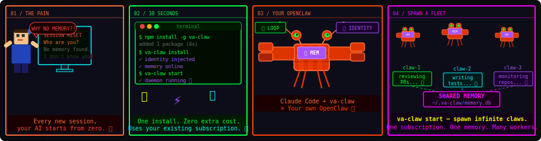

<h1 align="center">va-claw</h1>

<p align="center">
  <b>30 秒，让你的 Claude Code 或 OpenCode 进化成 OpenClaw。</b>
</p>

<p align="center">
  <a href="https://github.com/Vadaski/va-claw/actions/workflows/ci.yml">
    
  </a>
  <a href="https://www.npmjs.com/package/va-claw">
    
  </a>
  <a href="LICENSE">
    
  </a>
  <a href="https://www.npmjs.com/package/va-claw">
    
  </a>
</p>

<p align="center">
  <a href="https://vadaski.github.io/va-claw">🌐 官网</a> •
  <a href="#快速开始">快速开始</a> •
  <a href="#工作原理">工作原理</a> •
  <a href="#功能详解">功能详解</a> •
  <a href="#频道接入">频道接入</a> •
  <a href="#对比-openclaw">对比 OpenClaw</a>
</p>

> [English](README.md)

---

## va-claw 是什么？

<p align="center">

</p>

**va-claw** 是一个轻量插件，为你已有的任意 CLI Agent 添加 OpenClaw 的三大核心能力：

| | 没有 va-claw | 有 va-claw |
|---|---|---|
| **记忆** | 每次会话重置 | 持久化 SQLite 记忆，支持语义搜索 |
| **身份** | 通用助手 | 固定 persona，每次会话自动注入 |
| **唤醒循环** | 需要你主动触发 | 定时守护进程自动唤醒 Agent |

> *无需新网关，无需学新 CLI。装上插件，你现有的 `claude` 或 `codex` 就拥有了持久记忆、固定身份，并能在后台自主运行。*

---

## 通过 Skill 安装（零配置）

最快的安装方式是在任意 Claude Code 或 OpenCode 会话中执行安装 skill，Agent 会自动完成所有步骤——检查先决条件、执行安装、配置身份、启动守护进程。

```bash
# 在任意 Claude Code 或 OpenCode 会话中运行：
/install https://raw.githubusercontent.com/Vadaski/va-claw/main/skills/install-va-claw.md
```

或者将其添加为持久 skill，以便未来任意 Agent 都能自行安装 va-claw：

```bash
va-claw skill add https://raw.githubusercontent.com/Vadaski/va-claw/main/skills/install-va-claw.md
```

安装完成后，fleet 管理语言支持（`va-claw` + `claw` fleet 状态查询）默认已包含。

### 从 OpenClaw 或其他 AI 助手迁移

如果你在 OpenClaw 或其他 Claude 系助手中已积累了记忆数据，可以使用迁移 skill 让 Agent 自动打包记忆并导入 va-claw，无需任何手动操作：

```bash
/install https://raw.githubusercontent.com/Vadaski/va-claw/main/skills/migrate-to-va-claw.md
```

Agent 会自检已存储的上下文，生成一份可直接运行的 `va-claw memory memorize` 命令脚本，并解释为什么迁移对 Agent 和用户都有好处。

---

## 快速开始

### 先决条件

- **Node.js** >= 22
- 已安装 **Claude Code**（`npm install -g @anthropic-ai/claude-code`）或 **OpenCode / Codex**

### 安装并启动

```bash
npm install -g va-claw
va-claw install        # 将身份注入 ~/.claude/CLAUDE.md 或 ~/.codex/instructions.md
va-claw start          # 启动后台守护进程
```

就这些。你的 CLI Agent 现在拥有了记忆、固定身份，并在后台自主运行。

### 第一步

```bash
# 查看 Agent 最近在做什么
va-claw memory list

# 搜索历史唤醒输出
va-claw memory recall "上次在做什么"

# 检查守护进程健康状态
va-claw status
```

### 使用示例

**1. 用自然语言查询 fleet 状态**

```bash
va-claw protocol --text
```

输出一份 fleet 快照：守护进程状态、记忆状态，以及所有 claw 的名称与当前运行状态。

**2. 创建并追踪一个长期任务 claw**

```bash
va-claw claw add review-claw \
  --goal "Review PRs and summarize risks" \
  --status "running" \
  --tags "review,automation"
va-claw claw list
```

输出应包含 `review-claw` 的 goal、status、tags，表明任务已注册成功。

**3. 更新运行中的 claw**

```bash
va-claw claw set review-claw --status working --note "Investigating auth module"
va-claw claw heartbeat review-claw
```

用于记录 claw 当前正在处理的内容，并刷新最后活跃时间。

**4. 快速查看 fleet 概览**

```bash
va-claw claw status
```

返回所有 claw 的运行状态摘要，附带守护进程与服务健康信息。

**5. 下线过期 claw 并验证**

```bash
va-claw claw remove review-claw
va-claw protocol --text
```

确认该 claw 已消失，fleet 快照已更新。

---

## 工作原理

```
 ┌──────────────────┐       ┌──────────────────┐
 │   Claude Code    │       │  OpenCode/Codex  │
 └────────┬─────────┘       └────────┬─────────┘
          │  注入身份                  │  注入身份
          │  通过 CLAUDE.md / instructions.md
          └──────────┬───────────────┘
                     │
          ┌──────────▼───────────┐
          │    va-claw 守护进程   │
          │                      │
          │  ┌────────────────┐  │
          │  │  唤醒循环       │  │  ← cron 定时，静默运行
          │  │  (croner)      │  │
          │  └───────┬────────┘  │
          │          │           │
          │  ┌───────▼────────┐  │
          │  │  记忆存储       │  │  ← SQLite，~/.va-claw/memory.db
          │  │  (node:sqlite) │  │
          │  └───────┬────────┘  │
          │          │           │
          │  ┌───────▼────────┐  │
          │  │  Skills 层     │  │  ← Markdown 格式，零编译
          │  └────────────────┘  │
          └──────────────────────┘
                     │
         ┌───────────┼───────────┐
         │           │           │
    ┌────▼────┐ ┌────▼────┐ ┌───▼─────┐
    │ Discord │ │Telegram │ │  Slack  │
    └─────────┘ └─────────┘ └─────────┘
```

**单一守护进程。本地 SQLite。零云端依赖。** 每次唤醒的输出自动写入记忆，下一次会话始终有上下文可用。

---

## 功能详解

### 🕸 长期 claw 的 Fleet 协议

安装完成后，你和 Agent 都可以通过自然语言查询 claw 运行状态：

- "我的 claw 们都在干什么？"
- "显示我的 claw fleet"
- "给我一份 fleet 快照"

这会映射到：

```bash
va-claw protocol --text
```

管理操作通过 CLI 完成：

```bash
va-claw claw list
va-claw claw add <name> --goal "..." --status idle
va-claw claw set <name> --status running
va-claw claw heartbeat <name>
va-claw claw remove <name>
```

### 🧠 记忆

结构化 SQLite 记忆，支持完整 CRUD、艾宾浩斯遗忘曲线和加权召回。Agent 不只是记录输出——它会记忆、遗忘，并随时间变得更智能。

**存储一条命名记忆：**

```bash
va-claw memory memorize "auth-pattern" \
  "Always use JWT with 1h expiry and refresh token rotation" \
  --tags auth,security \
  --importance 0.9 \
  --details "Single-use refresh tokens mandatory after Feb incident"
```

**完整 CRUD：**

```bash
va-claw memory get auth-pattern                        # 按 key 检索
va-claw memory update auth-pattern --importance 1.0    # 更新字段
va-claw memory forget auth-pattern                     # 删除单条记忆
va-claw memory clear                                   # 清空全部
```

**召回：**

```bash
va-claw memory recall "JWT authentication"   # 加权搜索：tags > triggers > essence > details
va-claw memory list --limit 20               # 最近条目
```

**维护（艾宾浩斯模型）：**

```bash
va-claw memory consolidate   # 清理衰减记忆，强化最近访问的条目
va-claw memory reflect       # 按 tag 分组的 Markdown 摘要
```

每条记忆都有 `strength`、`importance` 和 `decayTau`。高重要性记忆的衰减速度慢约 3 倍。访问一条记忆会强化它。`consolidate` 自动执行遗忘曲线并清理已失效的条目。

### 🎭 身份

定义 Agent 的名称、persona 和行为方式一次，自动注入每一次 Claude Code 或 OpenCode 会话。

```bash
va-claw identity setup    # 交互式向导
va-claw identity show     # 查看当前配置
```

配置文件位于 `~/.va-claw/config.json`：

```json
{
  "name": "Nova",
  "persona": "Precise and calm. Senior engineer mindset.",
  "systemPrompt": "Act with continuity. Check memory before starting.",
  "wakePrompt": "Check repo status and summarize what needs attention.",
  "loopInterval": "0 * * * *"
}
```

**开发者 Agent 的真实 `wakePrompt` 示例：**

```json
{
  "name": "Nova",
  "persona": "Precise and calm. Senior engineer mindset.",
  "systemPrompt": "Act with continuity. Check memory before starting.",
  "wakePrompt": "Open the current repository and do a quick operator health pass: inspect git status, note any uncommitted changes, check the most recent CI/test signals, identify the highest-risk file touched recently, and leave a short summary with the next concrete action if attention is needed.",
  "wakeTimeoutMs": 300000,
  "loopInterval": "0 * * * *"
}
```

### ⏰ 唤醒循环

本地 cron 守护进程，按计划唤醒 Agent 并将输出写回记忆。

```bash
va-claw start      # 启动守护进程
va-claw stop       # 停止守护进程
va-claw status     # 检查健康状态 + 最后唤醒时间
```

典型用途：每日站会摘要、仓库健康检查、自动 PR 审查、后台调研。

## 长期运行注意事项

如果计划让 `va-claw` 持续运行数周或数月，请把唤醒循环当作一个常驻运营进程来对待：规划 token 预算，关注本地磁盘增长，在日志积累成噪音之前做好轮转。

**Token 预算估算：** 简单公式是 `每日唤醒次数 × 平均每次唤醒 token 数`。每小时唤醒是 `24次/天`；每 15 分钟唤醒是 `96次/天`。若 prompt + 工具输出平均 1.5k token，每小时循环大约消耗 `36k token/天`，15 分钟循环大约 `144k token/天`。建议从保守的频率开始，仅在唤醒输出持续有价值时才缩短间隔。

**`memory.db` 增长：** `~/.va-claw/memory.db` 中的 SQLite 存储会随每次唤醒保存而增长。简短的仓库健康摘要每次约增长低个位数 KB；详细的调研或审查循环则增长更快。建议每月用 `du -h ~/.va-claw/memory.db` 检查大小，定期运行 `va-claw memory consolidate`，并避免在 wake prompt 中倾倒完整 diff 或长日志（除非你确实需要记住这些内容）。

**`wake.log` 轮转：** 每次唤醒都会向 `~/.va-claw/wake.log` 追加一行 JSON，包含时间戳、耗时、退出码和最后 2 KB 的合并输出。首次运行时自动创建该文件，之后使用系统工具轮转，避免无限增长。Linux 下的 `logrotate` 最简示例：

```conf
/home/you/.va-claw/wake.log {
  size 1M
  rotate 7
  copytruncate
  missingok
  notifempty
}
```

在 macOS 上，通常可以用一条小的 `newsyslog.conf` 规则或定期执行 `mv ~/.va-claw/wake.log ~/.va-claw/wake.log.$(date +%F)` 来实现。核心原则很简单：保留最近几份日志文件，删除最旧的，不要让唤醒诊断日志无限增长。

---

## Skills

用普通 Markdown 文件扩展 Agent 行为——无需编译，无需配置：

```bash
va-claw skill add ./my-skill.md                          # 本地文件
va-claw skill add https://example.com/skills/git.md      # 远程 URL

va-claw skill list
va-claw skill show <name>
va-claw skill remove <name>
```

> **安全提示：** 安装来源不明的 skill 前，请先用 [Skill Vetter](https://clawhub.ai/spclaudehome/Skill-vetter) 审查——这是一个零占用的 skill，会检查凭证访问、外部请求、混淆代码等风险，并生成风险报告。
>
> ```bash
> # 安装一次，永久可用
> va-claw skill add https://clawhub.ai/spclaudehome/Skill-vetter
> ```

skill 文件格式示例：

```markdown
---
name: git-hygiene
description: Check for stale branches and large commits
version: 1.0.0
triggers:
  - git
  - branch
  - commit
---

When checking the repository, always:
1. List branches older than 30 days
2. Flag commits larger than 500 lines
3. Suggest a cleanup plan
```

---

## 频道接入

将唤醒循环接入 Discord、Telegram 或 Slack，远程接收输出并发送指令。

### Discord

```bash
va-claw channel discord setup
va-claw channel discord start
va-claw channel discord status
```

### Telegram

```bash
va-claw channel telegram setup --token <bot-token>
va-claw channel telegram start
```

### Slack

```bash
va-claw channel slack setup --bot-token <xoxb-...> --app-token <xapp-...>
va-claw channel slack start
```

---

## 完整 CLI 参考

```bash
# 核心
va-claw install [--for claude-code|codex|all]
va-claw start | stop | status | uninstall
va-claw protocol [--text]

# 身份
va-claw identity setup | show | edit

# 记忆 — 完整 CRUD + 艾宾浩斯生命周期
va-claw memory memorize <key> <essence> [--tags t1,t2] [--details "..."] [--importance 0-1]
va-claw memory get <key>
va-claw memory update <key> [--essence "..."] [--tags "..."] [--importance 0-1] [--details "..."]
va-claw memory forget <key>
va-claw memory recall <query> [--limit <n>]
va-claw memory list [--limit <n>]
va-claw memory consolidate
va-claw memory reflect
va-claw memory clear

# Skills
va-claw skill list | add <path-or-url> | remove <name> | show <name>

# 长期 claw fleet
va-claw claw status
va-claw claw list
va-claw claw add <name> [--goal ...] [--status running|working|idle|waiting|error|offline|stopped] [--cli-command ...] [--note ...] [--tags ...]
va-claw claw set <name> [--goal ...] [--status ...] [--cli-command ...] [--note ...] [--tags ...] [--seen]
va-claw claw heartbeat <name>
va-claw claw remove <name>

# 频道
va-claw channel discord  setup | start | stop | status
va-claw channel telegram setup --token <t> | start | stop | status
va-claw channel slack    setup --bot-token <t> --app-token <t> | start | stop | status
```

---

## 对比 OpenClaw

| | **va-claw** | **OpenClaw** |
|---|---|---|
| **定位** | 现有 CLI 的插件 | 独立 AI Agent 系统 |
| **安装** | `npm install -g va-claw` | 完整网关安装 |
| **Agent** | Claude Code、OpenCode、Codex | 自有运行时 |
| **记忆** | SQLite（本地） | SQLite + Markdown 压缩 |
| **频道** | Discord、Telegram、Slack | WhatsApp、iMessage 等更多 |
| **体积** | ~2 MB，零云端依赖 | 完整服务栈 |
| **适合** | 已在用 Claude Code / Codex 的开发者 | 想要独立专属 Agent 的用户 |

**va-claw = OpenClaw 的灵魂 + Claude Code 的躯体。** 如果你已经在为 Claude Code 或 OpenCode 付费，不必再单独跑一套 Agent 系统——只需把你缺少的三大能力装上即可。

---

## 开发

```bash
git clone https://github.com/Vadaski/va-claw.git
cd va-claw
pnpm install
pnpm build
pnpm test
```

贡献指南见 [CONTRIBUTING.md](CONTRIBUTING.md)。

---

## 许可证

[MIT](LICENSE) © Vadaski
